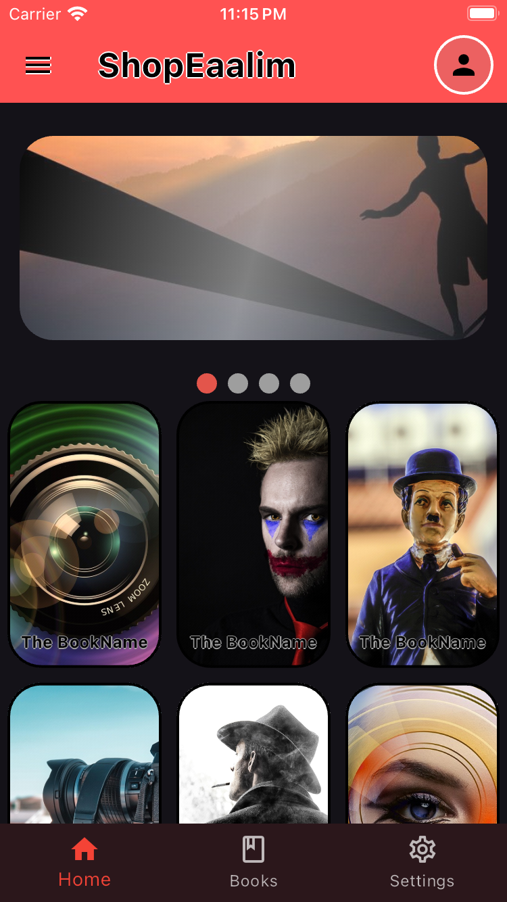
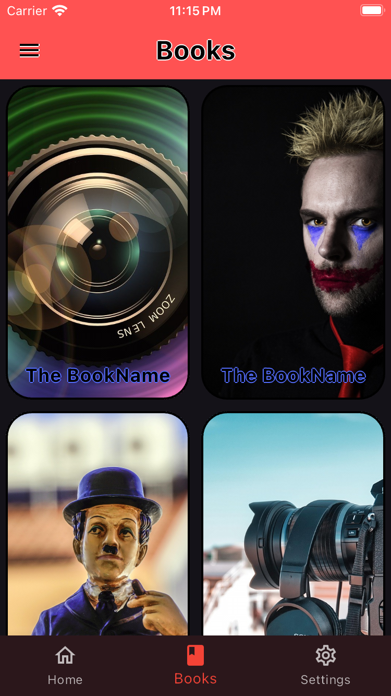
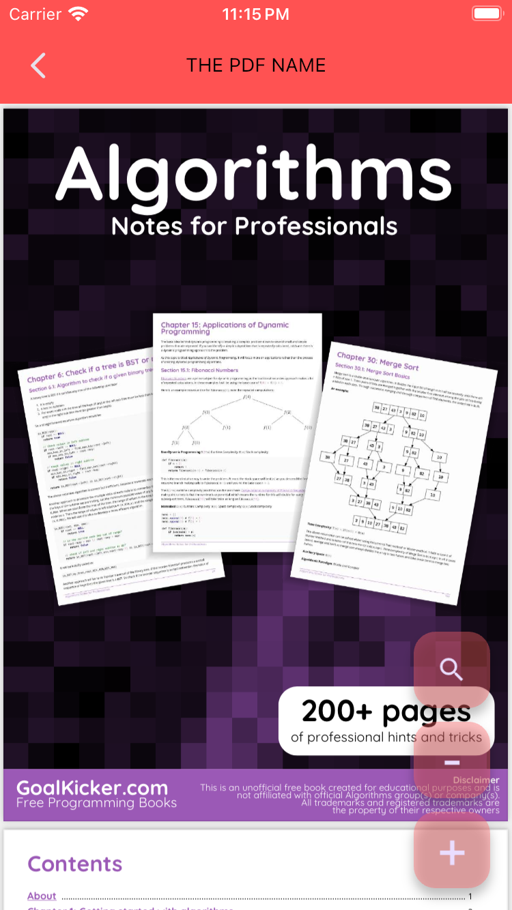
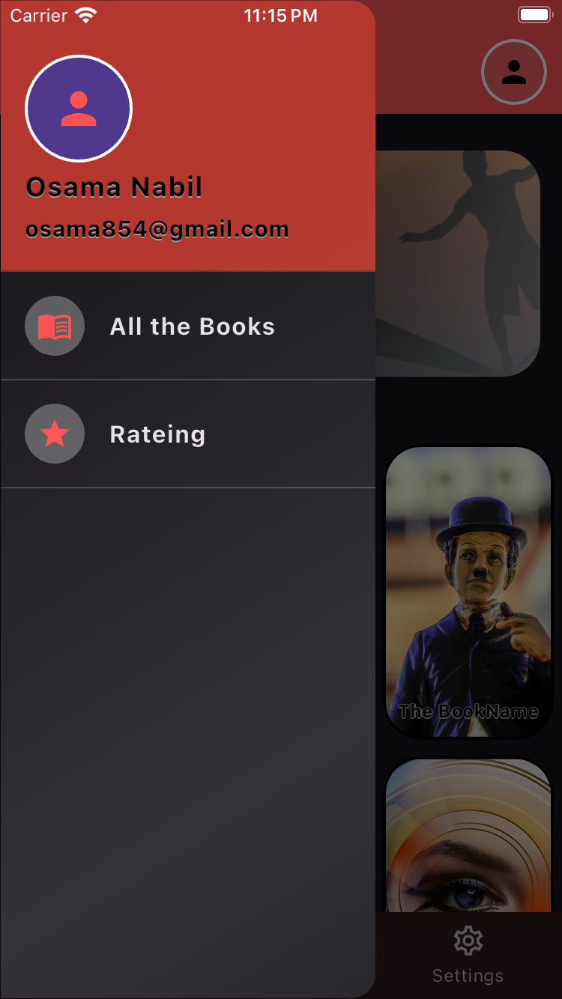
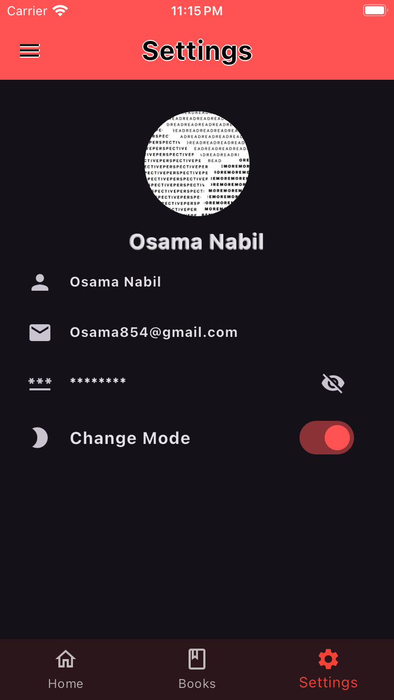
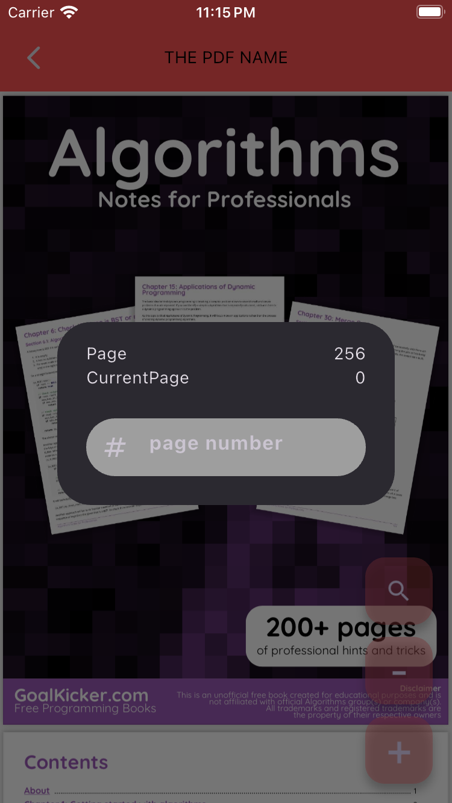

<p align="center">
  
</p>

<p align="center">
  
  
  
</p>

---

## 📚 Features
- 🔍 **Smart PDF Search** - Find text in documents instantly
- 📂 **Local Storage** - Hive-based book management
- 🌗 **Dark/Light Theme** - Automatic system theme detection
- 🚀 **Fast Performance** - Smooth PDF rendering
- 📖 **Reading Progress** - Track your reading position
- 🔒 **Offline Access** - No internet required
- 🗂️ **Book Organization** - Categorize by collections

---

## 🎥 Live Demo
<p align="center">
  
</p>

---

## 📸 Screenshots Gallery

| Home Screen | Book Shelf | PDF Viewer |
|-------------|------------|------------|
|  |  |  |

| Navigation Drawer | Settings | PDF Search |
|-------------------|----------|------------|
|  |  |  |

---

## 🏗 Architecture
```dart
📁 lib/
├── 📁 core/
│   ├── 📁 constants/
│   ├── 📁 utils/
│   └── 📁 themes/
├── 📁 data/
│   ├── 📁 datasources/  # Hive operations
│   ├── 📁 models/       # Book models
│   └── 📁 repositories/
├── 📁 presentation/
│   ├── 📁 bloc/         # BLoC states & events
│   ├── 📁 views/        # Screens
│   └── 📁 widgets/      # Reusable components
└── 📁 services/
     └── pdf_loader.dart